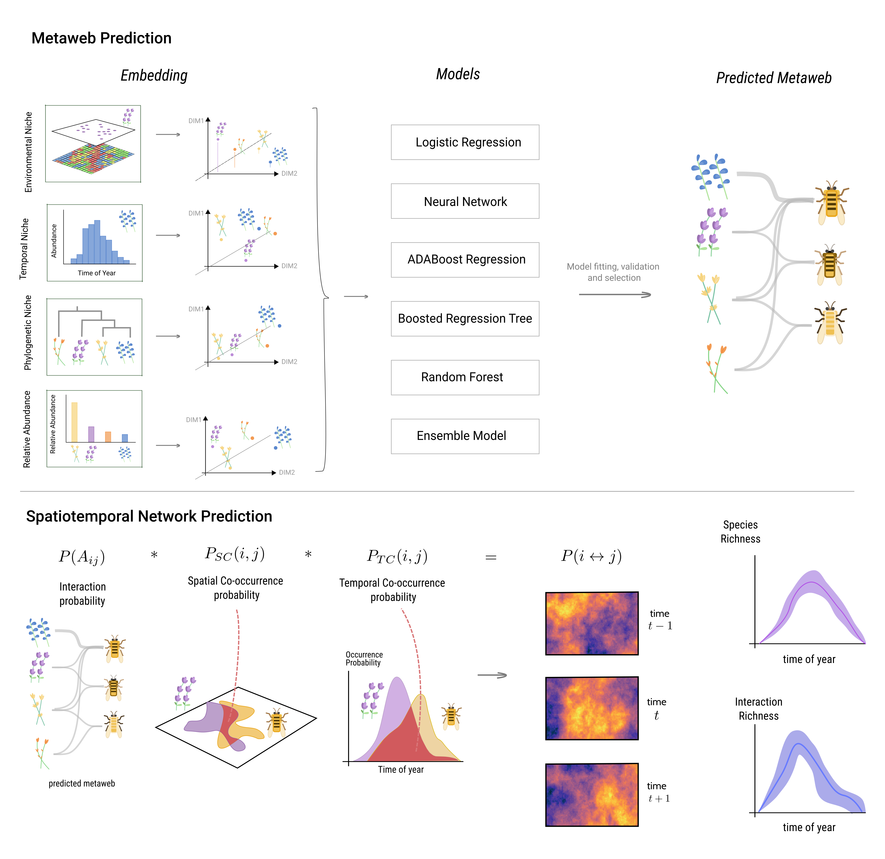

# Introduction

This document is for brainstorming the Colorado bumblebee metaweb prediction
project.

# 1 Data

The data consists of two parts, the field data collected at three stations
across Colorado, and the GBIF metaweb data aggregated and cleaned by Julian R.
and a student.

## 1.1 Field data

This data consists of nearly-daily records of visits between bee and flower
species for the months August-October. Data is collected from three field sites:
1) Rocky Mountain Biological Lab (RMBL)
2) Niwot Ridge
3) Pikes Peak

each with tens of plots each across an elevational gradient, collected for 7/4/3
summers total.

_To be determined_: specific number of plots per site and years per site

## 1.2 GBIF metaweb

This data of a network of bee/flower species which have a record of both
occurring on GBIF for locations at some spatial grain

_To be determined_: how does the scale of spatial aggregation affect properties of
metaweb, how much taxonomic overlap is there with field data?---We have a lot of
field data on interactions, but we can’t validate predictions on taxa that
aren’t present in field data. As a result validation can only be done on
interactions for which both species appear in field data.

# Methods

{#fig:concept}

Where $X_{ij}$ is and $L_{abc}$ is .

as in gravel et al 2017
$$P(X_{iy}, X_{jy}, L_{ijy} | E_y) = P(X_{iy},X_{jy}P(L_{ijy} | X_{iy}, X_{jy}, E_y)$$

Then decompose probaility of co-occurence as
$$P(X_{iy}, X_{jy}) = P(X_{iy})P(X_{jy})$$

## A predictive model to make spatially explicit network prediction

The goal is two have two predictive models: interaction-predictor model and a
distribution-predictor model (a la Strydom & Catchen et al. 2021, figure 2).

The interaction-predictor model, $f_i(s_i,s_j, \theta_i)$ predicts interaction based on
species-level features $(s_i, s_j)$, and is trained on the field-data.

These features could include Phylogeny (to be determined: how available are
genomes or trees for these species) Environment/Climate Traits (to be
determined: what trait data is available, how annoying is it to clean) Time
(only for the phenology model, see 3.2 and 3.3)

The distribution-predictor model, $f_s(s_i, \vec{x}, t)$ is trained on GBIF data to
predict the occurrence of species with features si at a location in space x, and
time t. Many options here. Here the species level features could be  Climatic
variables derived from remote sensing products. Co-occurence to make a JSDM
Potentially weighted by phenology information from field data.  Time (only for
the phenology model, see 3.2 and 3.3)

## Combining distribution-predictor and interaction-predictor models

Can split this into two based on how the distribution-predictor works. If $f_s$
predicts co-occurrence, then draw the species pool first and predict
interactions between the species in that pool. If $f_s$ is a single-species SDM,
get the occurrence probability for each species p_s and compute the probability
of observing interaction as function of the product of occ. prob.

# Results

After comparing different combinations of features/model structures and finding
the ‘best’ performing model on validation data.

## Figure one: spatial species pool and network prediction

Figure that is two panels: a map of total species richness and a map of network
properties across Colorado. This model doesn’t consider time, only other
predictors.

## Figure two: Phenology  

Same as figure one but consists of maps but at different times of the year (e.g.
March, June, August) and uses both an interaction-predictor and
distribution-predictor that incorporate time into predictions

##  Figure three: Climate  

Much as climate change has shifted temperature gradients to get warmer toward
the poles, it has also moved temperature gradients up in elevation.

We can get a CMIP6 forecast of temperature and precipitation, and then predict
how many observed interactions in the field data will no longer have their
composing species’ distributions overlap. Decompose temporal component of
overlap from spatial component.

# Discussion

## Acknowledgements

# References
