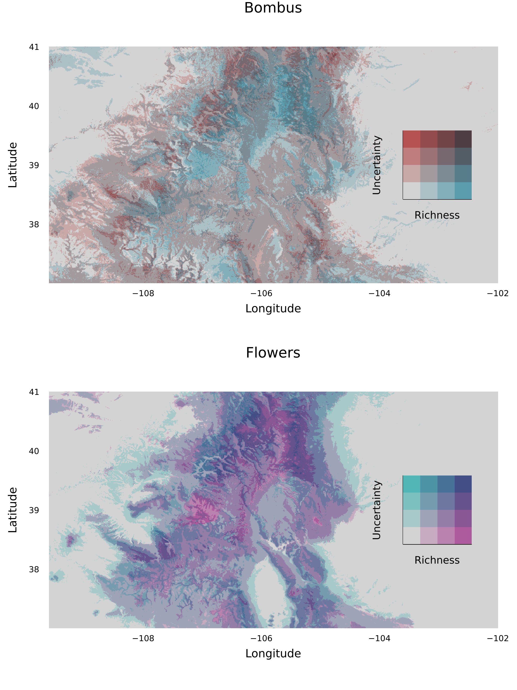

## Abstract

Using a data set of [DESCRIBE EACH DATASET IN A NICE WAY], we predict
a spatiotemporally explicit metaweb of interactions between bumblebees
(_Bombus_) and wildflowers (within _find clade_). We integrate this
data with crowdsourced occurrence data and climate data to [best paint
the picture of the Colorado bumblebee-plant metaweb]. Using temporal
climate data, we forecast how the spatiotemporal overlap of
interacting species will change under proposed climate scenarios. We
use this to estimate what interactions between bees and plants need
the most attention to prevent the spatiotemporal decoupling of an
interactions from threatening ecosystem functioning or the persistence
of a species.

# Introduction

Ecosystems emerge from sets of interactions between pairs of species.
these interactions produce the dynamics and persistence of ecosystems,
and the abundance and diversity of the species within them.
Plant-pollinator interactions specifically drive the function and
persistence of "architecture of biodiversity" [@Bascompte2007PlaMut].
However, we are far from a robust understanding of plant-pollinator
networks. This is because sampling interactions is costly.
Interactions vary in space and time [@Poisot2015SpeWhy]---particularly
relevant in this system [@CaraDonna2014ShiFlo]. This is why there is
interest in using models to predict interactions from sparse data
[@Strydom2021]. In this paper, we combine several datasets, each
spanning several years, to produce spatially and temporally explicit
predictions of the bumblebee (genus _Bombus_) and wildflower
pollination network across the state of Colorado.

We do this in two parts: (1) metaweb prediction and (2) conditioning
our metaweb prediction on co-occurrence probability.
First, we build a model to predict the metaweb---the network of _all_
interactions, aggregated across all times and spatial locations---of
_Bombus_ and wildflower species across Colorado. (Why do this? The
metaweb is more predictable than local interactions.) We do this using
network embedding [@cite]. Network embedding takes each node in the
network (either a bumblebee or a wildflower) and represents it in a
latent $n$ dimensional space. Combination of running models on
Temporal niche (T), Phylogenetic niche (P), Environmental niche (E),
and relative abundance in community (RA).

Second, we then use this metaweb to predict the structure of networks
at specific locations and times of year [@Gravel2019BriElt].
Finally we suggest a map of sampling priority, which
suggests the locations to sample that will best improve our understanding
of the Colorado _Bombus_ pollination metaweb.

Why is this good for science, what does this contribute to our
understanding of plant-pollinator ints, networks, Bombus, predictive
models, etc.,  and how can these results be useful.

# Data and methodology

We use three separate field datasets to estimate the Colorado _Bombus_
metaweb.

# Predicting the metaweb

## Feature Embedding

### Environmental niche features

We take the 19 BioClim layers from CHELSA (cite; 1km resolution) and a
map of elevation and PCA them. A resulting 4 layers cover 99.5% of the
variance. We use species occurrence data from GBIF, and consider each
occurrence record as a point in environment space. Then we fit a
multivariate normal distribution to these points in environmental
space.

### Temporal niche features

We take the mean and variance of the distribution of number of
observations per week of year in the interaction field data.

### Phylogenetic features

#### Phylogeny Construction

We construct phylogenies for both _Bombus_ and wildflower species
using barcode markers, mitochondrial COI and chloroplast rbcL,
respectively. These sequences were obtained from NCBI GenBank for all
species. For species for which no sequence was available (only a
handful of plants), their was substituted with a barcode from a member
of the same genus. Justify why this is fine here.

These sequences were aligned using ClustalOmega v???, and then a
posterior distribution of phylogenies and consensus tree was obtained
via MrBayes v??, using XX substition model with gamma-distributed
rates. Run until convergence, which here we define as the
standard-deviation of splits falling below 0.1.  

#### Creating an embedding from phylogenies

We simulate traits. Relationship between number of traits, num output PCA dimensions,
and number of used dimensions in the model matter. Describe how that works.

### Relative Abundance

This embedding is the simplest.

## Metaweb Model Fitting and Validation

We fit a bunch of models using MLJ.jl. Some of them are bagged, some are not bagged.

We train each model on each possible combination of features.

AUC-ROC and AUC-PR values below in @fig:prroc

{#fig:prroc}

What does this tell us? The ensemble model is regularly the best for
ROC, but not for PR. This illustrates an inherent trade-off between
models being as "right" as possible versus a model being useful for
discovering false-negatives.

***Figure 3: Embedded networks pre and post prediction a la that virus paper***

# Predicting networks in space and time

Now that we have a metaweb, we can extend this to predict interactions
at particular places and times by decomposing the probability of
interaction at particular place and time into probability of
interaction multiplied by probability of co-occurrence via properties
of conditional probability [@Gravel2019BriElt].

## Spatial prediction

Boosted regression tree using EvoTrees.jl, using data from GBIF.

How do we define? $P(i \leftrightarrow j)$ Is it $P(A_{ij})P(O_{ij})$ or $P(A_{ij})P(O_i)P(O_j)$

## Temporal prediction

***Figure 5: Maps over time figure and Prob(Connectance) vs. Month figure***

# Prioritizing spatial sampling of pollinator interactions

How do we improve out understanding of this pollination network,
or determine if it is changing over time?

***Figure 4: Uncertainty and sampling priority map***

# Discussion

We predict things alright. Emphasizes how heterogenous data sources
can improve interaction prediction (rocpr fig). Advances network embedding
as a framework for prediction of species interaction networks.

Embedding is a good tool for x. How do we select the dimensionality
of our predictors? [Paper on ecological dimensionality]. But this
doesn't mean 7-dimensions is adaquete to describe our predictors
in models to predict species interactions.  
